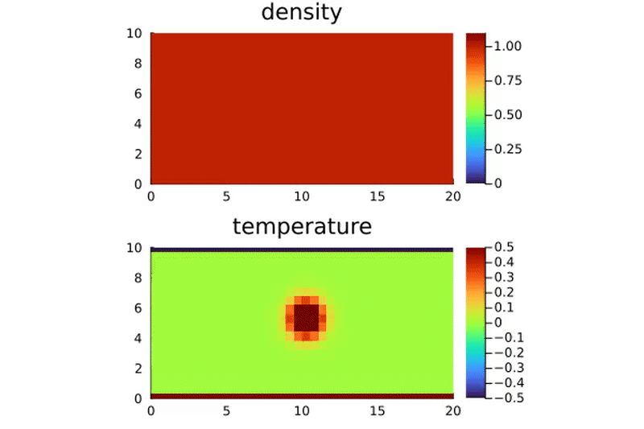
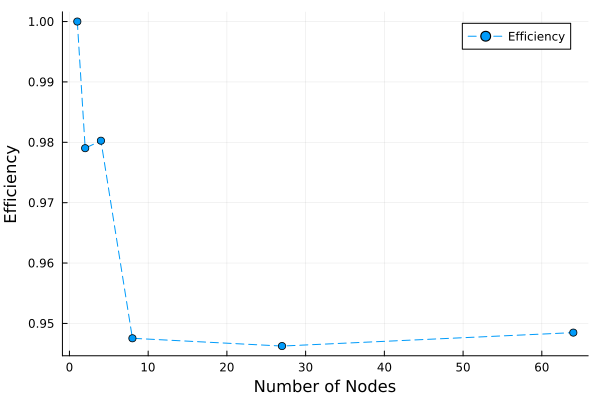

# [LatticeBoltzmann.jl](https://github.com/0xBachmann/LatticeBoltzmann.jl)

This project implements a highly parallelized version of the Lattice Boltzmann Method (LBM), designed to simulate fluid dynamics and thermal convection in three-dimensional domains. Leveraging modern multi-core CPUs and GPUs to achieve exceptional performance and scalability is crucial for good performance. Support for both (multi) CPU and GPU is implemented.

## Lattice Boltzmann Method

Unlike traditional Computational Fluid Dynamics (CFD) methods, which numerically solve the conservation equations for macroscopic properties such as mass, momentum, and energy, the Lattice Boltzmann Method (LBM) models fluids as collections of fictitious particles. These particles experience successive propagation and collision processes on a discrete lattice.

LBM orignates from the Boltzmann equations and is capable of solving different PDE's such as Navier-Stokes equations or advection-diffusion. LBM operates by evolving the distribution function $f_i(\boldsymbol{x}, t)$, which represents the probability of particles moving in discrete directions $\boldsymbol{e}_i $ at position $\boldsymbol{x}$ and time $t$. The method uses the discrete lattice structure where $f_i$ are updated via a two step process: *collision* and *streaming*.

1. **Collision:**
   Redistribution of $f_i$

   $$
   f_i^\star(\boldsymbol{x}, t) = f_i(\boldsymbol{x}, t) + \Omega_i,
   $$

   where $\Omega_i$ is the collision term describing the interaction between particles. The most common collsion term is the Bhatnagar–Gross–Krook (BGK) approximation

   $$
   \Omega_i = \frac{1}{\tau}(f_i^\mathrm{eq} - f_i(\boldsymbol{x}, t))
   $$

   where $\tau$ is the relaxation time controlling viscosity and $f_i^\mathrm{eq}$ is some local equilibrium distribution.
2. **Streaming:**
   Propagate $f_i^\star$ along discrete lattice direction $\boldsymbol{e}_i$

   $$
   f_i(\boldsymbol{x} + \boldsymbol{e}_i\Delta t, t + \Delta t) = f_i^\star(\boldsymbol{x}, t).
   $$

### Equilibrium Distribution

The equilibrium distribution $f_i^\mathrm{eq}$ is derived from the Maxwell-Boltzmann distribution and can be approximated via Taylor series as

$$
f_i^\mathrm{eq} = w_i\rho\left(1 + \frac{\boldsymbol{e}_i\cdot\boldsymbol{u}}{c_s^2} + \frac{(\boldsymbol{e}_i\cdot\boldsymbol{u})^2}{2c_s^4} - \frac{\boldsymbol{u}\cdot\boldsymbol{u}}{2c_s^2}\right),
$$

where $\rho$ is the local fluid density, $\boldsymbol{u}$ the local fluid velocity,  $w_i$ some weights and $c_s$ the lattice speed of sound. Both $w_i$ and $c_s$ depend on the choice of lattice, i.e. the directions $\boldsymbol{e}_i$. The macroscopic values density $\rho$ and velocity $\boldsymbol{u}$ can be obtained via

$$
\rho = \sum_i f_i,\qquad \rho\boldsymbol{u}=\sum_i f_i\boldsymbol{e}_i.
$$

### DnQm Lattices

Lattice Boltzmann models can be operated on a number of different lattices, both cubic and triangular, and with or without rest particles in the discrete distribution function. A popular way to classify different lattices is with the _DnQm_ scheme. Here Dn stands for n dimension and Qm for m directions. For example, D2Q9 is a two dimensional grid with 9 directions. The direction and weights are given below.

#### D2Q9 Direction Vectors and Weights

| Index ($i$) | Direction Vector ($ \boldsymbol{e}_i $) | Weight ($w_i$)   |
|---------------|-------------------------------------|--------------------|
| $0$             | $(0, 0)$                             | $ \frac{4}{9} $  |
| $1$             | $(1, 0)$                             | $ \frac{1}{9} $  |
| $2$             | $(0, 1)$                             | $ \frac{1}{9} $  |
| $3$             | $(-1, 0)$                            | $ \frac{1}{9} $  |
| $4$             | $(0, -1)$                            | $ \frac{1}{9} $  |
| $5$             | $(1, 1)$                             | $ \frac{1}{36} $ |
| $6$             | $(-1, 1)$                            | $ \frac{1}{36} $ |
| $7$             | $(-1, -1)$                           | $ \frac{1}{36} $ |
| $8$             | $(1, -1)$                            | $ \frac{1}{36} $ |

Thus each point interacts with all of its nearest neighbours. It is also possible to interact with farther neighbours but this project only supports nearest neighbours (i.e. 8 neighbours in 2D and 26 neighbours in 3D).

### Boundary Conditions

One strength of LBM is its capability to handle complex boundaries. Only in the streaming step boundaries need to be considered and only the directions that are coming out of a wall or outside of the domain are unknown.

#### Neumann Boundary Conditions

The simplest boundary conditions are bounce-back method which simulates no-slip velocity boundary condition, i.e. walls. The working principle of bounce-back boundaries is that populations hitting a rigid wall during propagation are reflected back to where they originally came from. This is captured by the following streaming step in case direction $i$ points into a wall or outside of the boundary

$$
f_{\bar{i}}(\boldsymbol{x}_b, t + \Delta t) = f_i^\star(\boldsymbol{x}_b, t),
$$

where $\boldsymbol{x}_b$ is a node next to a boundary and $\bar{i}$ is the opposite direction of $i$, i.e. $\boldsymbol{e}\_{\bar{i}} = -\boldsymbol{e}_i$. Thus the unkonw are taken from within the domain.

#### Dirichlet Boundary Conditions

When we want to enforce a specific value at a boundary, we need to prescribe the values of the incoming directions. An immediate idea would be to just take the equilibrium distribution $f_i^\mathrm{eq}$, however this only achieves limited accuracy. [Zou/He][Zou/He] propose more involved boundary conditions for pressure and velocity boundary conditions, which are very common.

Due to its simplicity however, this project uses anti-bounce-back for dirichlet boundary conditions (see [Krueger et al][Krueger et al]). The anti-bounce-back method is very similar in form to the bounce-back

$$
f_{\bar{i}}(\boldsymbol{x}_b, t + \Delta t) = -f_i^\star(\boldsymbol{x}_b, t) + 2f_i^\mathrm{eq}(\boldsymbol{x}_w, t + \Delta t),
$$

where $\boldsymbol{x}_w$ is the location of the wlal. Dirichlet values enter via the equilibirum distribution. In case the wall is at rest, i.e. has zero velocity, anti-bounce-back simplifies to

$$
f_{\bar{i}}(\boldsymbol{x}_b, t + \Delta t) = -f_i^\star(\boldsymbol{x}_b, t) + 2w_iC_w,
$$

where $C_w$ is the to be imposed Dirichlet value.

### Thermal LBM

To incorporate temperature into the system can be done straightforward by adding a second population $g_i$ for the energy. This population follows the same steps as $f_i$

$$
g_i(\boldsymbol{x} + \boldsymbol{e}_i\Delta t, t + \Delta t) = g_i(\boldsymbol{x}, t) + \Omega_i.
$$

Then the local temperature can be recovered by

$$
T = \sum_i g_i
$$

The BGK collision operatore is also suitable for temperature. But now there are two relaxation times, $\tau_f$ and $\tau_g$ respectively. The relaxation time for temperature $\tau_g$ influences the thermal diffusivity. In comparison to the densitiy population, a more simple equilibrium function is sufficient for the temperature population (see [Krueger et al])

$$
g_i^\mathrm{eq} = w_i T \left(1+\frac{\boldsymbol{e}_i\cdot\boldsymbol{u}}{c_s^2}\right)
$$

Note that the inclusion of a sencond population requires double the amount of memory. Working with only one population is possible but a lot more complicated and requires lattices with discrete directions of size 2.

#### Boussinesq Approximation

Temperature induced density change will lead to a buoyancy force leading to coupling between temperature and density and thus between populations $f_i$ and $g_i$. Using the *Boussinesq Approximation* the buoyancy force is given by

$$
\boldsymbol{F}_b = -\alpha\rho_0(T-T_0)\boldsymbol{g},
$$

where $\alpha$ is the thermal expansion coefficient of the fluid and $\boldsymbol{g}$ is gravity, $T_0$ and $\rho_0$ are reference density and temperature respectively. To account for this force, we need to make two small adjustments to the LBM procedure.

1. Account for force when computing velocity:
   
   $$
   \boldsymbol{u} = \frac{1}{\rho}\left(\sum_i f_i\boldsymbol{e}_i + \frac{\boldsymbol{F}\Delta t}{2}\right)
   $$
   
2. Compute source term $S_i$

   $$
   S_i = \left(1-\frac{\Delta t}{2\tau}\right)w_i\left(\frac{\boldsymbol{F}\cdot\boldsymbol{e}_i}{c_s^2} + \frac{(\boldsymbol{F}\cdot\boldsymbol{e}_i)(\boldsymbol{u}\cdot\boldsymbol{e}_i)}{c_s^4} - \frac{\boldsymbol{F}\cdot\boldsymbol{u}}{c_s^2}\right)
   $$

   and add it to collision of the density population

   $$
   f_i^\star(\boldsymbol{x}, t) = f_i(\boldsymbol{x}, t) + \Omega_i + S_i.
   $$

Note that this change holds for any external force.

If viscous heating and compression work are relevant, then an additional source term needs to be added to the temperature population as well (see [Krueger et al]).

For the population $g_i$ the BGK operator is also feasible

For more simpicity, only the temperature difference is simulated instead of absolute temperature.

### Nondimensionalization

Because in lattice units $\Delta t$ and $\Delta x$ are fixed to $1$, nondimensionalization is a useful tool to beeing able to map problems simulated to real world values. We will denote lattice values with a superscript $\star$. To have a full set of reference units we still need weight and temperature. Choosing $\rho^\star = 1$ and $T^\star = 1$ as reference units completes the set together with $\Delta t = 1$ and $\Delta x = 1$. Now to transform between real world and lattice values one can take a reference value and transform it according to same linear scalar. E.g. the real $\Delta x = \frac{L_x}{N_x}$, where $L_x$ is the domain length in $x$ and $N_x$ is the number of grid points in $x$, thus

$$
\Delta x = C_m \Delta x^\star,
$$

where $C_m$ is the scaling factor for length units (*meters*) and as $\Delta x^\star = 1$

$$
C_m = \frac{\Delta x}{\Delta x^\star} = \frac{L_x}{N_x}.
$$

Then lattice values can be calculated by multiplying away units. E.g. nondimensionalizing gravity:

$$
\boldsymbol{g}^\star = \boldsymbol{g}\frac{C_s^2}{C_m},
$$

where $C_s$ is the scaling factor for time units (*seconds*).

The remaining values can be transformed in a similar manner.

## Rayleigh-Bénard Convection

This project simulates the Rayleigh-Bénard convection. The geometrical setup for the Rayleigh-Bénard convection involves two parallel plates separated by a distance $H$. The bottom plate is kept at a higher temperature than the top plate (Dirichlet temperature boundary conditions) $T_b > T_t$. At the same time, both plates are subject to the no-slip condition for the fluid velocity. In the presence of gravity $g$, the fluid at the bottom plate will heat u, leading to a decrease of its density (if $\alpha>0$) and therefore a buoyancy force. There exists a stationary solution to this problem with zero velocity everywhere. This state is called conductive because heat is only transported from the hot to the cold plate by conduction. However, if the system is perturbed (e.g. by adding small random velocity or temperature fluctuations) and the temperature gradient is sufficiently large, parts of the heated fluid will move upwards while colder fluid from the top will move down. This will eventually lead to convection. The The physics of the Rayleigh-Bénard convection is governed by the *Rayleigh number*

$$
\mathrm{Ra} = \frac{\alpha|\boldsymbol{g}|(T_b - T_t) H^3}{\kappa\nu},
$$

where $\kappa$ and $\nu$ are thermal diffusivity and kinematic viscosity of the fluid, respectively. For low values of the Rayleigh number ($\mathrm{Ra} \lesssim 1000$) the perturbations are dissipated by viscosity. If $\mathrm{Ra}$ becomes larger, bouyancy can overcome dissipation, and convection sets in.

As $\mathrm{Ra}$ is a nondimensional number, its lattice counterpart is the same ($\mathrm{Ra} = \mathrm{Ra}^\star$).

## Implementation

The framework [`ParallelStencil.jl`](https://github.com/omlins/ParallelStencil.jl) is used to allow for parallelization on either CPU or GPU. Furthermore [`ImplicitGlobalGrid.jl`](https://github.com/eth-cscs/ImplicitGlobalGrid.jl) seamingle interoperate with it to allow for multi CPU/XPU distribution.

To work conveniently with the Q direction of the populations [`CellArrays.jl`](https://github.com/omlins/CellArrays.jl) are used. This allows to create the population vectors as follows

```julia
population = @zeros(nx, ny, nz, celldims=Q)
```

Because sometimes a single entry of the cell needs to be updated (boundary conditions) the [`CellArraysIndexing.jl`](https://github.com/albert-de-montserrat/CellArraysIndexing.jl) wrapper of `CellArrays.jl` is used. With this its possible to update a direction `iq` as follows

```julia
@index population[iq, ix, iy, iz] = new_value
```

Then a kernel looks something like this

```julia
@parallel_indices (i, j, k) function streaming!(pop, pop_buf)
    for q in 1:Q
        @index pop_buf[q, i, j, k] = @index pop[q, i - directions[q][1], j - directions[q][2], k - directions[q][3]]
    end
    return
end
```

where `directions` is a `StaticArray` of `StaticArray`s containing the lattice direction vectors. Because no standard finite difference stencils are used, all kernels are `@parallel_indices` kernels and operate on all `Q` directions of a given cell.

The project implements thermal flow in 3D. The lattices D3Q15, D3Q19 and D3Q27 are supporded. Before including `LatticeBoltzmann3D.jl` define global variable `method` to either `:D3Q15`, `:D3Q19` or `:D3Q27` to get the respective lattice. The speed of sound in each lattice is $c_s=\sqrt{3}$.

Bounce-back and anti-bounce-back boundary conditions are implemented for the domain borders. Any stairlike walls with no-slip boundary condition could easily be implemented by defining an array containing information of where the solid wall is and then perform bounce back on every cell where the direction vector points into the solid.

The main function is

```julia
thermal_convection_lbm_3D(; N=40, nt=10000, Ra=1000., do_vis=true, manage_MPI=true)
```

which simulated the Rayleigh-Bénard convection on an `N * N/2 * N` domain (the plates are separated in $y$ dimension) for `nt` steps with Rayleigh number `Ra`. The flags `do_vis` and `manage_MPI` allow to toggle plotting and initilization/finalization of MPI. For visualization [FFmpeg](https://www.ffmpeg.org/) is required. The initial perturbation is a 3D Gaussian with higher temerature in the middle of the domain. It sets parameters as below and the thermal diffusivity $\kappa$ is computed form the prescribed Rayleigh number.

```julia
lx, ly, lz = 20, 10, 20

α       = 0.0003    # thermal expansion
ρ_0     = 1.        # density
gravity = @SVector [0., -1., 0.]
ΔT      = 1.        # temperature difference of the plates
ν       = 5e-2      # viscosity close to 0 -> near incompressible limit
```

The physical $\Delta x$ is computed as `lx/nx` and the physical time step $\Delta t$ should be chosen such that the maximum lattice velocity does not exceed $0.4$ for stability reasons (see [Krueger et al]). To ensure this, $\Delta t$ can be related to $\Delta x$ as $\boldsymbol{u}^\star = \boldsymbol{u}\frac{\Delta t}{\Delta x}$.

The respective relaxation times are then computed from kinematic viscosity $\nu$ and thermal diffusivity $\kappa$ es follows (see [Krueger et al])

$$
\begin{align}
    \tau_f^\star = \frac{\nu^\star}{(c_s^\star)^2} + 0.5 \\
    \tau_g^\star = \frac{\kappa^\star}{(c_s^\star)^2} + 0.5
\end{align}
$$

Here is a small sample script that simulated with the D3Q19 lattice on CPU

```julia
using ParallelStencil

@init_parallel_stencil(Threads, Float64, 3, inbounds=true)

const method = :D3Q19
include("path/to/LatticeBoltzmann3D.jl")

thermal_convection_lbm_3D()
```

After initializing the populations with the respective equilibrium distributions, `nt` LBM iterations are performed. One iteration of LBM consits of

1. Computing forces (buoyancy)
2. Update moments (density, velocity, temperature)
3. Collsision step
   1. Halo exchange
4. Streaming step
5. Boundary conditions

To allow for multi CPU/GPU implementation, ghost cells are added to the population fields for the halo exchange. Because only the population fields depend on its neighbours, the moments don't need ghost cells and be exchanged. Boundary conditions then are applied to the inner points of the population, overriding grabage values that have been streamed into the domain from the ghost cells. The halo exchange can be hidden behing the collision step to reduce communication overhead. `ImplicitGlobalGrid.jl` provides the macro `@hide_communication` to achieve this. One iteration then looks like this

```julia
@parallel range_values compute_force!(forces, temperature, gravity, α, ρ_0)

@parallel range_values update_moments!(velocity, density, temperature, density_pop, temperature_pop, forces)

@hide_communication b_width begin
    @parallel collision!(density_pop, temperature_pop, velocity, density, temperature, forces, _τ_density_lattice, _τ_temperature_lattice)
    update_halo!(density_pop, temperature_pop)
end

@parallel inner_range_pop streaming!(density_pop, density_pop_buf, temperature_pop, temperature_pop_buf)

@parallel boundary_conditions(...)

# pointerswap buffers and fields
```

## Results

Unless specified, all simulations below use the default parameters of `thermal_convection_lbm_3D`, i.e.

```julia
N  = 40      # -> nx, ny, nz = 40, 20, 40
nt = 10000
Ra = 1000.0
```

and a single core.

### Verification of Diffusion vs Convection

The below results are obtained by simulating the Rayleigh-Bénard convection with default parameters but different values of `Ra` with the D3Q19 lattice. Because of the low viscosity, we are near incompressible regime and thus the density does not change much. As can be seen, with higher Rayleigh number conveciton sets in. However it already sets in at comparatively low Rayleigh number (100). This might be due to errors in nondimensionalizing or wrong computation of $\mathrm{Ra}$. See `scripts/plotting.ipynb` to reproduce.

<div style="text-align: center;">
    <div style="display: flex; justify-content: center; align-items: center; gap: 10px; flex-wrap: wrap;">
        <figure style="flex: 1 1 30%; text-align: center; margin: 10px;">
            
            <figcaption>$\mathrm{Ra}=10$</figcaption>
        </figure>
        <figure style="flex: 1 1 30%; text-align: center; margin: 10px;">
            
            <figcaption>$\mathrm{Ra}=100$</figcaption>
        </figure>
        <figure style="flex: 1 1 30%; text-align: center; margin: 10px;">
            
            <figcaption>$\mathrm{Ra}=1000$</figcaption>
        </figure>
    </div>
    <p style="margin-top: 10px;">Comparison of Rayleigh-Bénard convection with different Rayleigh numbers during  $10\,000$ steps.</p>
</div>

### Parallel Efficiency

To assess the parallel performance, a weak scaling benchmark was performed on Piz Daint. For single core, `N = 360` was used which results in almost $16\mathrm{GiB}$ memory usage, thus the whole GPU. Computing the effective memory access as

$$
A_{\mathrm{eff}} = 2D_u + 2D_k,
$$

where $D_u$ is size of the unknown fields, i.e. those who change every iteration and $D_k$ the size of the known fields, results in an effective memory throughput $T_\mathrm{eff} = 292\mathrm{GB/s}$. This is not too high in comparison to $\approx550\mathrm{GB/s}$ advertised maximum throughput of the P100 on Piz Daint. The actuall memory throughput should be a bit higher because different fields are getting used multiple times, i.e. the force field first gets computed in `compute_force!` and then used both in `update_moments!` and `collision`. Nonetheless, the parallel efficiency is quite high as can be seen below. With $64$ cores the code still achieves $95\%$ of the memory throughput of a single core run.



### 3D Plots

Contour plot on the result of `scripts/lb_3D_multixpu.jl`. See `scripts/plotting.ipynb` to reproduce.


Volume slice plot on the result of `scripts/lb_3D_multixpu.jl` with `N=200`. See `scripts/plotting.ipynb` to reproduce.


### High-Resolution Simulation

High-resolution simulation on Piz Daint over 4 GPU's with local size `N=360`, thus a global size of `738 x 358 x 360` and for `nt=100000` time steps.


## References

\[1\] [Krueger, T., Kusumaatmaja, H., Kuzmin, A., Shardt, O., Silva, G., & Viggen, E. M. (2016). The Lattice Boltzmann Method: Principles and Practice. (Graduate Texts in Physics). Springer.][Krueger et al]

\[2\] [Qisu Zou, Xiaoyi He; On pressure and velocity boundary conditions for the lattice Boltzmann BGK model. Physics of Fluids 1 June 1997; 9 (6): 1591–1598.][Zou/He]

[Zou/He]: https://doi.org/10.1063/1.869307

[Krueger et al]: https://doi.org/10.1007/978-3-319-44649-3
